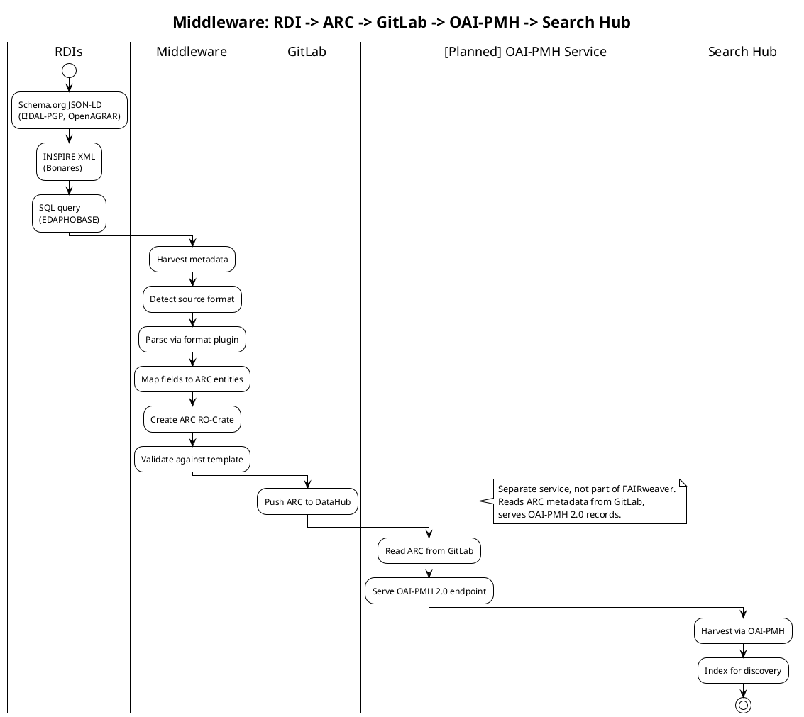

# Middleware Federation Service — Architecture

## Overview

This document describes the Middleware Federation Service that harvests domain-specific dataset metadata from Research Data Infrastructures (RDIs), creates ARCs from the harvested metadata, and publishes them to GitLab DataHub for FAIRagro Search Hub ingestion.

**Key insight:** Agrischemas is the aspirational internal entity model for ARCs, but it is in development and not yet adopted by any RDI. RDIs provide metadata in their own formats (Schema.org, INSPIRE, SQL, CSV). The middleware always converts to ARC as the canonical intermediary.

## Architecture

```
RDIs (various formats)
  -> Middleware Federation Service
    -> Harvest Adapter (OAI-PMH / REST / SQL)
    -> Format Detector
    -> Format Plugins (schema_org, inspire, darwin_core_csv, sql_reader)
    -> ARC Builder (creates RO-Crate)
    -> Push ARC to GitLab DataHub

[Planned] OAI-PMH Service (separate, not part of FAIRweaver)
  -> Reads ARC metadata from GitLab
  -> Serves OAI-PMH 2.0 endpoint

FAIRagro Search Hub
  -> Harvests via OAI-PMH from planned service
```

## RDI Sources

| RDI | Protocol | Format | Notes |
|-----|----------|--------|-------|
| E!DAL-PGP | OAI-PMH | Schema.org JSON-LD | Plant genetics & phenotyping |
| Bonares Repository | OAI-PMH | INSPIRE XML | Agricultural research data |
| EDAPHOBASE | SQL | SQL Database | Soil & environmental data |
| OpenAGRAR | REST API | Schema.org JSON-LD | Agricultural research data |

## Middleware Components

| Component | Purpose |
|-----------|---------|
| Harvest Adapter | Connects to RDIs via OAI-PMH, REST API, or SQL query |
| Format Detector | Identifies source format (Schema.org, INSPIRE, CSV, SQL) |
| Format Plugins | Parse source format into flat dict (schema_org, inspire, darwin_core_csv, sql_reader) |
| ARC Builder | Maps flat dict to ARC entities (Investigation, Study, Assay, Factor, Protocol) |
| Pivot Registry | Agrischemas profiles used as internal entity model (aspirational) |

## Data Flow



## ARC Structure (Domain-Specific Objects)

ARCs created by the middleware contain domain-specific entities:

| Entity | Agrischemas Target | Coverage |
|--------|-------------------|----------|
| Investigation | FieldTrialStudy | ~86% -- `location` missing |
| Study | FieldTrialStudy | Fields map to trial metadata |
| Assay | FieldTrialStudy | Experimental data |
| Factor | FieldTrialStudy | Experimental conditions |
| Investigation | CropVariety | ~88% -- `variety`, `registrationYear` missing |
| Study | CropVariety | Variety context |

**Note:** Agrischemas profiles (FieldTrialStudy, CropVariety) are aspirational. They define the modeling target for ARCs but are not yet adopted by RDIs. Coverage gaps represent divergence between current RDI metadata and the ideal Agrischemas model.

## GitLab DataHub Integration

- ARCs are pushed to GitLab with metadata: identifier, set_spec, sourceRDI
- GitLab serves as the canonical storage layer for ARC RO-Crates
- No direct RDI access from Search Hub -- all data flows through GitLab

## [Planned] OAI-PMH Service

- **Separate service**, not part of FAIRweaver
- Reads ARC metadata from GitLab DataHub
- Serves OAI-PMH 2.0 endpoint for Search Hub harvest
- FAIRweaver has an OAI-PMH endpoint (`/oai-pmh`) for testing/demo purposes only -- this is NOT the production OAI-PMH service

## Slot 6 Discussion Points

1. **ARC modeling guidelines:** How should domain-specific objects be structured within ARCs to maximize future Agrischemas compliance?

2. **Coverage gaps:** What strategies can fill the gaps (location, variety, registrationYear) -- manual curation, inference from context, or RDI enrichment?

3. **GitLab integration:** Should the middleware register ARCs in a specific GitLab group/project structure? What metadata should accompany each ARC?

4. **OAI-PMH service:** What group maintains it? What are the OAI-PMH sets and metadata formats?

5. **Scheduling:** Should the middleware periodically re-harvest from RDIs, or is on-demand sufficient?

6. **Versioning:** How should the middleware handle version changes in ARC templates or Agrischemas profiles?

## Related Diagrams

- `middleware-federation-architecture.puml` -- Component-level architecture with planned OAI-PMH
- `middleware-harvest-flow.puml` -- Step-by-step activity diagram with OAI-PMH service
- `arc-to-agrischemas-modeling.puml` -- Domain-specific entity mapping with coverage gaps
- `conversion-pipeline-simple.puml` -- FAIRweaver demo tool (manual simulation of middleware)
- `conversion-pipeline-detailed.puml` -- FAIRweaver demo tool (C4 detailed view)
