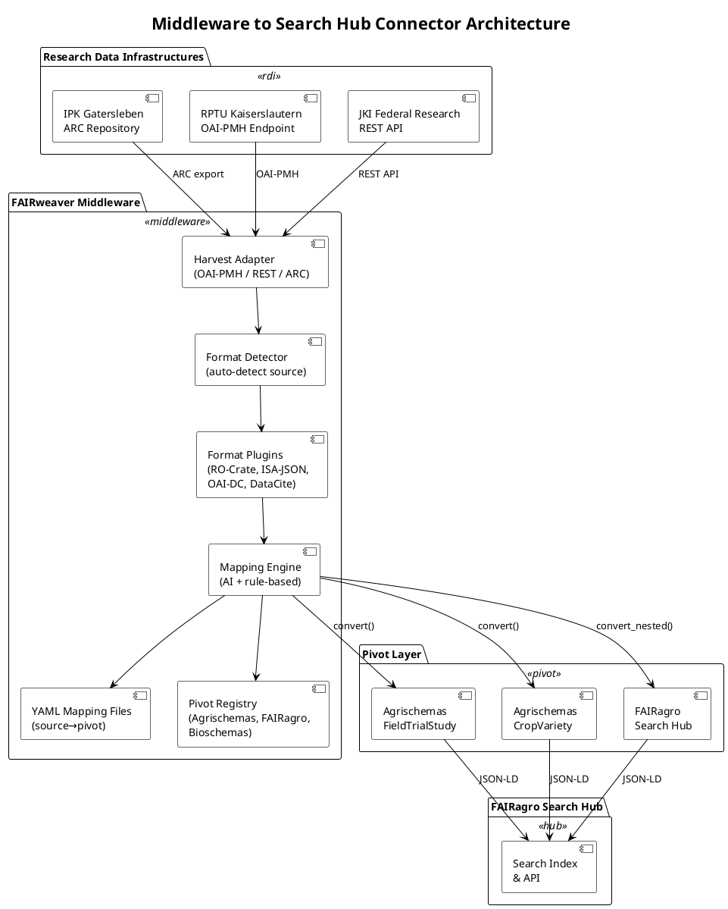
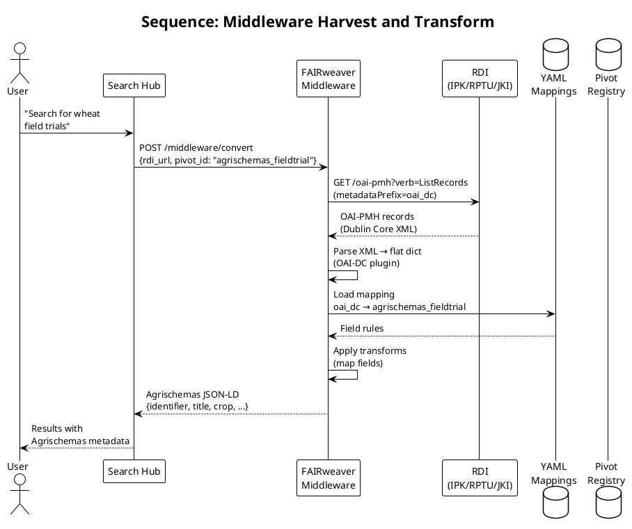

# Middleware to Search Hub Connector — Architecture

## Overview

This document describes the architecture for connecting Research Data Infrastructures (RDIs) to the FAIRagro Search Hub through FAIRweaver as the transformation middleware. The connector harvests domain-specific metadata from RDIs, converts it to Agrischemas-compliant format, and exposes it for Search Hub ingestion.

## Scope

- **In scope:** Architecture for harvesting from RDIs, transforming to Agrischemas, and serving to Search Hub
- **Out of scope:** Implementation details (this is a design document for Slot 6 discussion)

---

## Architecture Diagram (PlantUML)



## Data Flow Diagram

```plantuml
@startuml
!theme plain

title Data Flow: RDI → Middleware → Search Hub

|#FEF3C7| RDI |
|#D1FAE5| Middleware |
|#DBEAFE| Pivot |
|#FCE7F3| Search Hub |

| RDI|
start
:ARC RO-Crate\nmetadata;
:OAI-PMH\nDublin Core;
:REST API\nJSON;

| Middleware|
:Harvest records\nfrom RDI endpoint;
:Detect source format\n(RO-Crate, XML, JSON);
:Parse via format plugin\n→ flat dict;

:Apply YAML mapping\n(source → pivot);

if (Target pivot?) then (fairagro_searchhub)
  :convert_nested()\nblock structure;
  :FAIRagro JSON-LD\n(citation, crop, sensor);
else (agrischemas_fieldtrial)
  :convert()\nflat structure;
  :Agrischemas JSON-LD\n(title, crop, startDate);
else (agrischemas_cropvariety)
  :convert()\nflat structure;
  :Agrischemas JSON-LD\n(crop, name, variety);
endif

| Search Hub|
:Ingest JSON-LD;
:Index for discovery;
stop

@enduml
```

## Component Interaction (Sequence)



## RDI Types and Connectors

| RDI Type | Protocol | FAIRweaver Plugin | Notes |
|----------|----------|-------------------|-------|
| ARC Repository | ARC export (JSON-LD) | `ro_crate` | Direct ARC RO-Crate ingestion |
| OAI-PMH Endpoint | OAI-PMH 2.0 | `oai_dc` | Standard metadata harvesting |
| REST API | HTTP/JSON | `schema_org` | Schema.org JSON-LD endpoints |
| ISA-Tab | ISA-Tab files | `isa_json` | ISA investigation files |

## Transformation Paths

```
Path 1: ARC → Agrischemas (Field Trial)
  RDI (ARC) → ro_crate plugin → agrischemas_fieldtrial mapping → JSON-LD

Path 2: ARC → Agrischemas (Crop Variety)
  RDI (ARC) → ro_crate plugin → agrischemas_cropvariety mapping → JSON-LD

Path 3: OAI-PMH → FAIRagro Search Hub
  RDI (OAI-PMH) → oai_dc plugin → fairagro_searchhub mapping → JSON-LD

Path 4: Schema.org → FAIRagro Search Hub
  RDI (REST) → schema_org plugin → fairagro_searchhub mapping → JSON-LD
```

## Mapping Coverage

| Source → Target | Required Fields | Coverage | Notes |
|-----------------|----------------|----------|-------|
| ro_crate → agrischemas_fieldtrial | 6 required | 86% | `location` missing — must be supplied |
| ro_crate → agrischemas_cropvariety | 3 required | 88% | `variety`, `registrationYear` missing |
| ro_crate → fairagro_searchhub | 4 required (citation) | ~90% | Block structure with crop/sensor |
| oai_dc → fairagro_searchhub | 4 required (citation) | ~80% | Limited crop/sensor from DC |

## Key Design Decisions

1. **Pivot-based transformation:** All conversions go through the MappingEngine with YAML mapping files. No hard-coded transformation logic.

2. **Graceful degradation:** If a mapping doesn't exist for a source→target pair, the AI fallback generates one (with lower confidence).

3. **Block vs flat:** FAIRagro Search Hub uses block structure (`convert_nested`), Agrischemas uses flat structure (`convert`). The engine supports both.

4. **Plugin extensibility:** New RDI types need only a new format plugin implementing `load()` and `write()`. No engine changes required.

## Open Questions for Slot 6 Discussion

1. **sourceRDI field:** How should the middleware populate the `generalExtended.sourceRDI` field in FAIRagro Search Hub output? Options:
   - Auto-populate from the harvest URL
   - Require RDI registration in a registry
   - User-supplied at harvest time

2. **Authentication:** How should the middleware authenticate with RDIs that require credentials?
   - API key per RDI
   - OAuth2 flow
   - Mutual TLS

3. **Scheduling:** Should the middleware periodically re-harvest from RDIs, or is on-demand sufficient?
   - Cron-based re-harvest
   - Webhook push from RDI
   - On-demand only

4. **Versioning:** How should the middleware handle version changes in Agrischemas profiles?
   - Pin to specific version in mapping
   - Auto-detect latest compatible version
   - User selects version at harvest time
