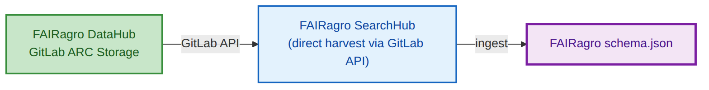
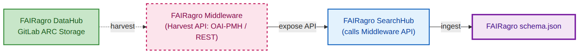

# FAIRweaver: Schema.org → ARC → FAIRagro Workflow

---

## Slide 1 — Pipeline Overview · The Map


**Sequential dependency**: Schema.org → ARC RO-Crate → placed on **DataHub**. Both harvest paths read from the DataHub to feed the SearchHub.

**Reference**: Full FAIRagro infrastructure → `diagrams/FAIRagro_TA3_TA4_Retreat_2006_Slot2_impulse.png`

**Tracing dataset**: Wheat Drought Phenotyping Field Trial 2024 (ID: `10.5447/<RDI>/2024/wheat-drought-001`)

---

## Slide 1 — Stage 1 · Input: FAIRagro Publication Metadata Set

Compliant with the FAIRagro Core Metadata Specification — flat, no ISA hierarchy, domain info as `about` entities.

```json
{
  "@context": { "@vocab": "https://schema.org/", "agrovoc": "http://aims.fao.org/aos/agrovoc/" },
  "@type": "Dataset",
  "@id": "https://doi.org/10.5447/<RDI>/2024/wheat-drought-001",
  "name": "Wheat Drought Phenotyping Field Trial 2024",
  "description": "Multi-temporal drone-based NDVI and multispectral imaging...",
  "url": "https://<RDI>.example.org/datasets/wheat-drought-2024",
  "license": "https://spdx.org/licenses/CC-BY-4.0.html",
  "keywords": [{ "@type": "DefinedTerm", "name": "wheat", "termCode": "agrovoc:c_8347" }],
  "identifier": {
    "@type": "PropertyValue",
    "propertyID": "https://registry.identifiers.org/registry/doi",
    "value": "10.5447/<RDI>/2024/wheat-drought-001"
  },
  "author": [{
    "@type": "Person", "name": "Liam Brennecke",
    "affiliation": { "@type": "Organization", "name": "RPTU University of Kaiserslautern" }
  }],
  "spatialCoverage": { "@type": "Place", "name": "RPTU Field Station Kaiserslautern" }
}
```

> 6 required FAIRagro fields present. `author` per §2.1.3; `spatialCoverage` per §2.1.12.
> Agrischemas domain entities → next slide.

---

## Slide 1 — Stage 1bis · Agrischemas: Same record, the `about` array

**Continuation of slide 1b** — same `Dataset`, same `@id` (`10.5447/<RDI>/2024/wheat-drought-001`). These entities go INSIDE the `Dataset` from the previous slide, under the `about` key.

```json
"about": [
  {
    "@type": "biosc:BioSample",
    "additionalType": "AGRO:AGRO_00000325",
    "additionalProperty": [{
      "@type": "PropertyValue", "name": "species",
      "propertyID": "agrovoc:c_331243", "value": "Triticum aestivum"
    }]
  },
  {
    "@type": "Product",
    "additionalType": "http://www.w3.org/ns/sosa/Sensor",
    "name": "Micasense RedEdge-MX"
  }
]
```

> Crop (BioSample + AGRO_00000325), Sensor (Product + sosa:Sensor). Ref: `knowledgebase.fairagro.net`

---

## Slide 1 — Stage 2 · Transformation: FAIRagro Template Applied

The YAML rule file is the bridge — declares how each FAIRagro field lands in the ARC.

```yaml
source_format: schema_org
pivot: fairagro_searchhub
field_rules:
  - source: "name"               → Invest.name            [direct copy]
  - source: "description"        → Invest.description     [direct copy]
  - source: "author"             → Invest.creator         [extract_person]
  - source: "identifier"         → Invest.identifier      [direct copy]
  - source: "spatialCoverage"    → Invest.location        [extract_place]
  - source: "about/BioSample"    → Study.crop             [extract_agrischemas]
  - source: "about/Product"      → Assay.instrument       [extract_sensor]
```

Three rule types: **direct copy** · **re-distribution** (Agrischemas → Study/Assay) · **extract** inline objects.
Source: `backend/mappings/schema_org-arc_ro_crate.yaml`

---

## Slide 1 — Stage 3 · Output A: ARC RO-Crate (ISA Hierarchy)

One flat `Dataset` becomes a **graph** of linked entities via `hasPart`.

```json
{
  "@context": ["https://w3id.org/ro/crate/1.1/context", { "@vocab": "https://schema.org/" }],
  "@graph": [
    {
      "@id": "./", "@type": "Dataset", "additionalType": "Investigation",
      "identifier": "10.5447/<RDI>/2024/wheat-drought-001",
      "name": "Wheat Drought Phenotyping Field Trial 2024",
      "creator": [{ "@id": "#Brennecke_Liam" }],
      "hasPart": [{ "@id": "#Study_wheat" }]
    },
    {
      "@id": "#Study_wheat", "@type": "Dataset", "additionalType": "Study",
      "crop_species": "Triticum aestivum",
      "crop_species_uri": "http://purl.obolibrary.org/obo/NCBITaxon_4565",
      "hasPart": [{ "@id": "#Assay_wheat" }]
    },
    {
      "@id": "#Assay_wheat", "@type": "Dataset", "additionalType": "Assay",
      "measurementTechnique": "Multispectral imaging",
      "technologyPlatform": "DJI Matrice 300 RTK UAV",
      "instrument": [{ "@id": "#Instrument_wheat" }]
    },
    { "@id": "#Brennecke_Liam", "@type": "Person", "name": "Liam Brennecke" },
    { "@id": "#Instrument_wheat", "@type": "Sensor", "name": "Micasense RedEdge-MX" }
  ]
}
```

> One `Dataset` → `@graph`. `hasPart` chains I→S→A. Inline objects extracted.
> See slides 3–4 for how **real** ARCs deviate.

---

## Slide 1 — Stage 4a · Harvest Path 1: DataHub Direct



**Direct harvest** — the SearchHub reads directly from the DataHub via the GitLab API. No middleware in the loop. ARCs are accessed as GitLab repo files; the SearchHub ingests the ARC RO-Crate and produces `schema.json`.

---

## Slide 1 — Stage 4b · Harvest Path 2: Middleware API



**Orchestrated harvest** via the federated Middleware. ARCs are stored on the DataHub; the Middleware harvests from the DataHub and exposes an API (OAI-PMH or REST) for the SearchHub to call. The Middleware never stores ARCs itself.

---

## Slide 1 — Stage 5 · Output B: FAIRagro SearchHub JSON

The ARC graph is flattened again — now organized by **domain block**.

```json
{
  "@context": "https://fairagro.net/schema/v1",
  "@type": "Dataset",
  "citation": {
    "title": "Wheat Drought Phenotyping Field Trial 2024",
    "author": [{ "name": "Liam Brennecke", "orcid": "0000-0002-7391-4826" }],
    "otherId": [{ "value": "10.5447/<RDI>/2024/wheat-drought-001" }]
  },
  "crop": {
    "crop": [{ "scientificName": "Triticum aestivum",
               "ontologyRef": "NCBITaxon_4565" }]
  },
  "sensor": {
    "sensor": [{ "name": "Micasense RedEdge-MX",
                 "platformType": "DJI Matrice 300 RTK UAV" }]
  },
  "location": {
    "name": "RPTU Field Station Kaiserslautern",
    "geo": { "latitude": 49.4401, "longitude": 7.7491 }
  }
}
```

> Domain-block grouped: `citation` · `crop` · `sensor` · `location`. Full block set in `pivot_registry.yaml`.

---

## Slide 1 — Pipeline Summary

| Stage | Format | Key change |
|-------|--------|------------|
| **Input** | Schema.org `Dataset` | Flat, inline objects |
| **Transform** | YAML `field_rules` | Routing & extraction rules |
| **Output A** | ARC RO-Crate `@graph` | ISA hierarchy, `@id` refs |
| **Harvest** | Path 1 (solid) or Path 2 (dashed) | Direct or orchestrated |
| **Output B** | `fairagro schema.json` | Domain-block grouped |

**Key insights:**
- ARC is the single source of truth — Output B always derived from Output A
- Both paths produce identical `schema.json`
- **Extraction depth?** → Slide 2
- **Real ARC deviations?** → Slides 3–5

---

## Slide 2 — Three File Scenarios: Input → ARC → FAIRagro Output

| Case | Input File | ARC Output | FAIRagro Output |
|------|-----------|------------|-----------------|
| **Synthetic** | `schema-org-wheat-full.json` | `arc-ro-crate-wheat-full` ✅ compliant | Full extraction ✅ |
| **Real — Small** | `arc-ro-crate-dronflyover.json` (<10 MB) | Manual, partial ⚠️ | Partial — mappable fields only |
| **Real — Large** | `arc-ro-crate-muenchenberg-lte.json` (>100 MB) | Manual, partial ⚠️ | Basic harvest only |

**💡 If an ARC follows the FAIRagro specification → full metadata extraction. If not → only basic information is harvested.**

---

## Slide 3 — Examining ARC Structure: Domain Objects at Different Depths

**Goal:**
- Understand how Agrischemas concepts map into ARC RO-Crate
- Show that equivalent domain concepts require very different traversal depths


**Example ARC RO-Crate:** UC13 drone-flyover

---

## Slide 4 — Müncheberg ARC: A Different Structural Pattern

**Goal:**
- Show another real ARC with a different structural pattern
- Reinforce that parser must handle multiple modeling conventions


**Example ARC RO-Crate:** Müncheberg LTE

---

## Slide 4 — Comparison: Drone Flyover vs Müncheberg

| Aspect | Drone Flyover | Müncheberg LTE |
|--------|--------------|----------------|
| **Study entity** | Explicit, in hasPart chain | Present but disconnected (not in hasPart) |
| **Crop species path (short)** | Study → LabProcess → Sample → PropertyValue (4 hops) | Source → additionalProperty → CharacteristicValue (2 hops) |
| **Crop species path (long)** | Same as short (only path) | ALSO via Study/LabProcess → object → Source → additionalProperty |
| **Sensor metadata** | Present (DefinedTerm) | Absent |
| **Assay count** | 1 | 27+ |

---

## Slide 5 — Required Modeling Pattern & Standardization Gap

**Goal:**
- Define the required path for unambiguous extraction
- Identify what still needs standardization


**In bold:** required objects/properties to represent Crop

**Example ARC RO-Crate:** UC13 drone-flyover

---

## Slide 5 — Open Questions

| | |
|---|---|
| **Structure: ?** | How to formally specify the required traversal path? |
| **propertyID: SSSOM mapping** | How to standardize ontology term mappings? |
