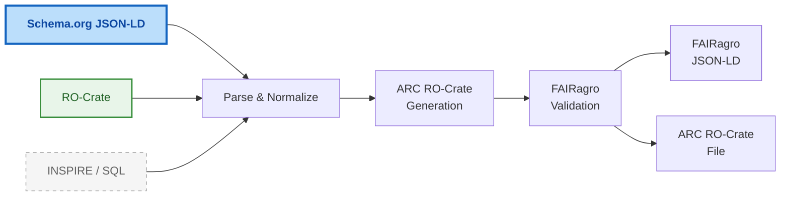
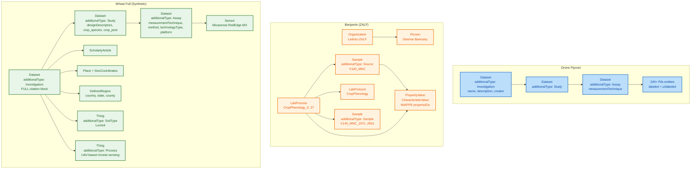
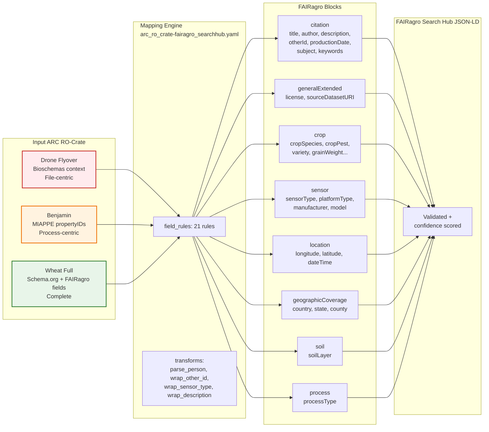

# FAIRweaver: Schema.org → ARC → FAIRagro Workflow

---

## Slide 1 — High-Level Pipeline



**What happens:**

- **Primary input:** Schema.org JSON-LD 
- **Other sources:** INSPIRE, SQL Database
- `Parse & Normalize`: format detection, plugin load, template selection
- **ARC Generation:** builds Investigation → Study → Assay hierarchy
- **Validation:** `FairagroArcValidator` checks against `fairagro_arc_v2` template (DataPLANT + FAIRagro)
- **Output:** FAIRagro Search Hub JSON-LD + downloadable ARC RO-Crate file

---

## Slide 2 — Three ARC RO-Crate Examples: Structural Comparison

### Option A: Markdown Table

| Aspect | Drone Flyover | Benjamin (ZALF) | Wheat Full (Synthetic) |
|--------|---------------|-----------------|------------------------|
| **Domain** | Drone imagery / phenotyping | Long-term crop phenology | Wheat drought phenotyping |
| **Context** | Bioschemas (`Sample`, `LabProtocol`, `LabProcess`) | Bioschemas + MIAPPE propertyIDs | Schema.org only |
| **Entities** | 1 Investigation, 1 Study, 1 Assay, 240+ Files | 1 Investigation, 1 Study, 1 Assay, 30+ Processes/Samples | 1 Investigation, 1 Study, 1 Assay, 3 Files |
| **Investigation** | Minimal (name, description, creator) | Implicit (via Organization/Person) | Full (name, description, creator, identifier, license, datePublished, contacts, publications) |
| **Study** | Only via `about` LabProcess | Via Source/Sample/Process chain | Explicit Study entity with designDescriptors, crop_species, crop_pest |
| **Assay** | Minimal (name, measurementTechnique) | Via LabProcess/Protocol | Full (measurementTechnique, measurementMethod, technologyType, technologyPlatform, instrument) |
| **Crop Metadata** | ❌ None | Via PropertyValue (MIAPPE propertyIDs) | Explicit fields (crop_species, crop_pest, URIs) |
| **Sensor Metadata** | ❌ None | ❌ None | Explicit (drone_manufacturer, drone_model) |
| **Location/Geo/Soil** | ❌ None | ❌ None | Explicit entities |
| **Data Files** | 240+ image files (labeled/unlabeled) | Referenced via columnIndex | 3 TIFF samples |
| **Compliance Level** | Basic RO-Crate | Deep ISA + MIAPPE | Full FAIRagro-ready |

### Option B: Mermaid Entity Hierarchy Diagram



---

## Slide 3 — FAIRagro Compliance: Required Fields Assessment

| FAIRagro Block | Required Field | Drone Flyover | Benjamin (ZALF) | Wheat Full |
|----------------|----------------|---------------|-----------------|------------|
| **citation** | `name` | ⚠️ In Investigation | ⚠️ Implicit | ✅ Investigation.name |
| | `description` | ⚠️ In Investigation | ⚠️ Implicit | ✅ Investigation.description |
| | `creator` | ✅ In Investigation | ⚠️ Person exists, not linked as creator | ✅ Investigation.creator[] |
| | `identifier` | ❌ Missing | ❌ Missing | ✅ Investigation.identifier |
| | `license` | ❌ Missing | ❌ Missing | ✅ Investigation.license |
| | `datePublished` | ❌ Missing | ❌ Missing | ✅ Investigation.datePublished |
| **generalExtended** | `license` | ❌ Missing | ❌ Missing | ✅ Investigation.license |
| | `sourceDatasetURI` | ❌ Missing | ❌ Missing | ✅ `@id` present |
| **crop** | `cropSpecies` | ❌ None | ⚠️ Via MIAPPE propertyID (zeamay, seccer, betvul...) | ✅ Study.crop_species |
| | `cropPest` | ❌ None | ❌ None | ✅ Study.crop_pest |
| | `cropSpeciesURI` | ❌ None | ❌ None | ✅ Study.crop_species_uri |
| | `cropPestURI` | ❌ None | ❌ None | ✅ Study.crop_pest_uri |
| **sensor** | `sensorType` | ❌ None | ❌ None | ✅ Assay.measurementTechnique |
| | `sensorPlatformType` | ❌ None | ❌ None | ✅ Assay.measurementMethod |
| | `sensorPlatformManufacturerName` | ❌ None | ❌ None | ✅ `#Instrument_wheat` |
| | `sensorPlatformModelName` | ❌ None | ❌ None | ✅ `#Instrument_wheat.name` |
| **location** | `longitude` | ❌ None | ❌ None | ✅ Location.geo.longitude |
| | `latitude` | ❌ None | ❌ None | ✅ Location.geo.latitude |
| **geographicCoverage** | `country` | ❌ None | ❌ None | ✅ GeographicCoverage.country |
| | `state` | ❌ None | ❌ None | ✅ GeographicCoverage.state |
| | `county` | ❌ None | ❌ None | ✅ GeographicCoverage.county |

**Legend:** ✅ Complete | ⚠️ Partial | ❌ Missing

**Summary:**

- **Wheat Full**: 100% — meets all FAIRagro Search Hub required fields
- **Benjamin**: ~20% — has crop data (MIAPPE), but missing citation, sensor, location, geo blocks
- **Drone Flyover**: ~10% — file-centric with minimal metadata structure

---

## Slide 4 — Gap Analysis & Transformation Pipeline

### Option A: Gap Analysis Summary

```
FAIRagro Mapping Pipeline (arc_ro_crate-fairagro_searchhub.yaml)
────────────────────────────────────────────────────────────────
ARC RO-Crate  →  21 field_rules  →  FAIRagro Search Hub JSON-LD
    │
    ├── Citation Block (7 rules)        ← Investigation fields
    ├── GeneralExtended Block (2 rules) ← license, @id
    ├── Crop Block (8 rules)            ← Study fields
    ├── Sensor Block (4 rules)          ← Assay fields
    ├── Location Block (3 rules)        ← drone coordinates
    ├── GeographicCoverage (3 rules)    ← country / state / county
    ├── Soil Block (1 rule)             ← soil depths
    └── Process Block (1 rule)          ← agricultural processes
```

**Key Findings:**

1. **Only Wheat Full** is FAIRagro-ready out-of-the-box
2. **Benjamin** has crop data via MIAPPE propertyIDs — needs SSSOM mapping to FAIRagro crop block
3. **Drone Flyover** is file-heavy but metadata-light — needs Investigation/Study/Assay enrichment
4. **Proposed Agrischemas model** (slides 7-9) standardizes: `Sample/Material` + `PropertyValue` + `propertyID: agrovoc:...`

### Option B: Mapping Pipeline Flowchart



**Transformation Implications:**

- Need **SSSOM mapping tables**: MIAPPE/agrovoc → FAIRagro crop/sensor vocabularies
- Need **template selection logic**: auto-detect ARC type → apply appropriate enrichment

---

