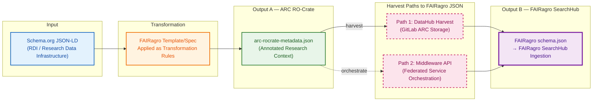
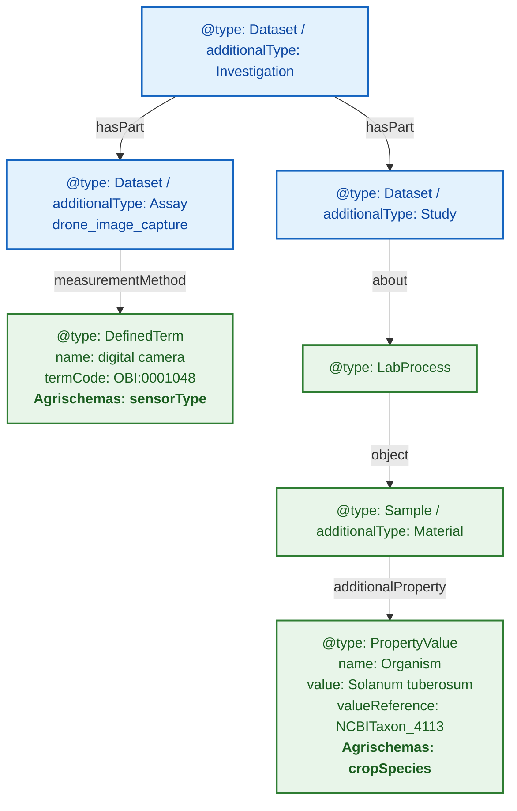
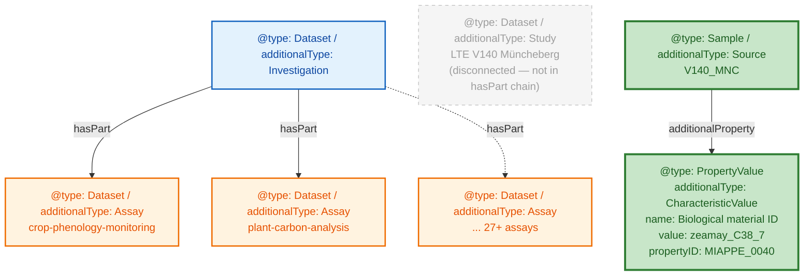
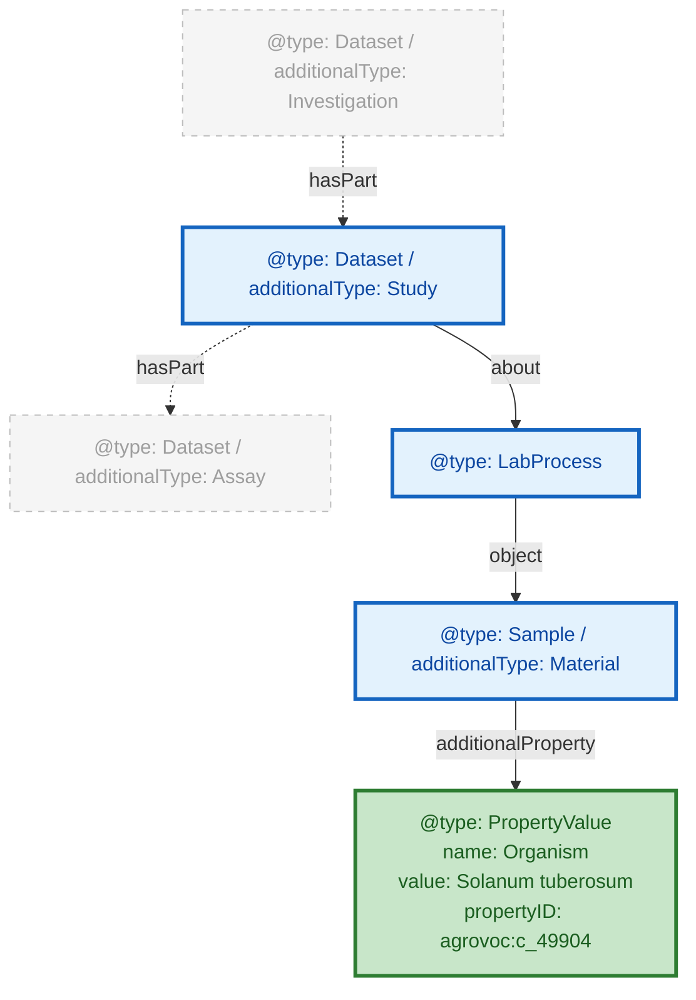

# FAIRweaver: Schema.org → ARC → FAIRagro Workflow

---

## Pipeline Overview — The Map



**Sequential dependency**: Output B is derived *from* Output A — not a parallel output.
Two harvest paths converge on the same `schema.json`.
Each following slide zooms into one stage.

**Tracing dataset**: Wheat Drought Phenotyping Field Trial 2024 (ID: `10.5447/fairweaver/2024/wheat-drought-001`)

---

## Stage 1 · Input: Schema.org JSON-LD from the RDI

What arrives from a Research Data Infrastructure: **flat**, no ISA hierarchy, all domain info inline.

```json
{
  "@context": "https://schema.org",
  "@type": "Dataset",
  "@id": "https://doi.org/10.5447/fairweaver/2024/wheat-drought-001",
  "name": "Wheat Drought Phenotyping Field Trial 2024",
  "description": "Multi-temporal drone-based NDVI and multispectral imaging of winter wheat under controlled drought stress...",
  "creator": {
    "@type": "Person",
    "name": "Timo Mühlhaus",
    "email": "timo.muehlhaus@rptu.de",
    "affiliation": { "@type": "Organization", "name": "RPTU University of Kaiserslautern" },
    "identifier": { "@type": "PropertyValue", "propertyID": "orcid", "value": "0000-0003-3925-6778" }
  },
  "identifier": "10.5447/fairweaver/2024/wheat-drought-001",
  "license": "https://creativecommons.org/licenses/by/4.0/",
  "datePublished": "2024-09-15",
  "keywords": ["wheat", "drought stress", "NDVI", "phenotyping"],
  "measurementTechnique": "Multispectral imaging",
  "measurementMethod": "NDVI calculation from red and near-infrared reflectance bands",
  "technologyPlatform": "DJI Matrice 300 RTK UAV",
  "instrument": {
    "@type": "Thing",
    "name": "Micasense RedEdge-MX",
    "additionalType": "Sensor"
  },
  "location": {
    "@type": "Place",
    "name": "RPTU Field Station Kaiserslautern",
    "geo": { "@type": "GeoCoordinates", "latitude": 49.4401, "longitude": 7.7491 }
  },
  "country": "Germany",
  "state": "Rhineland-Palatinate",
  "crop_species": "Triticum aestivum",
  "crop_species_uri": "http://purl.obolibrary.org/obo/NCBITaxon_4565",
  "soilType": "Luvisol",
  "processType": "UAV-based remote sensing"
}
```

> Flat record. No ISA hierarchy. No `@id` references. Inline objects (creator, instrument, location) embedded directly.

---

## Stage 2 · Transformation: FAIRagro Template Applied

The template (YAML rule file) is the bridge. It declares how each Schema.org field lands in the ARC.

```yaml
source_format: schema_org
pivot: fairagro_searchhub
version: "1.0.0"
field_rules:
  - source: "name"               → target: "Investigation.name"
  - source: "description"        → target: "Investigation.description"
  - source: "creator"            → target: "Investigation.creator"  [extract_person]
  - source: "identifier"         → target: "Investigation.identifier"
  - source: "crop_species"       → target: "Study.crop_species"
  - source: "crop_species_uri"   → target: "Study.crop_species_uri"
  - source: "measurementTechnique" → target: "Assay.measurementTechnique"
  - source: "technologyPlatform" → target: "Assay.technologyPlatform"
  - source: "instrument"         → target: "Assay.instrument"  [extract_sensor]
  - source: "location"           → target: "Investigation.location"  [extract_place]
  - source: "soilType"           → target: "Investigation.soil"  [extract_soil]
```

Three kinds of rules:
1. **Direct copy** — field lands verbatim at the target
2. **Re-distribution** — field moves to Study or Assay level
3. **Extract** — inline object becomes a separate graph entity with `@id` reference

Source: `backend/mappings/schema_org-arc_ro_crate.yaml`

---

## Stage 3 · Output A: ARC RO-Crate (ISA hierarchy)

One flat Schema.org `Dataset` becomes a **graph of linked entities** connected by `hasPart`.

```json
{
  "@context": [
    "https://w3id.org/ro/crate/1.1/context",
    { "@vocab": "https://schema.org/" }
  ],
  "@graph": [
    {
      "@id": "./",
      "@type": "Dataset", "additionalType": "Investigation",
      "identifier": "10.5447/fairweaver/2024/wheat-drought-001",
      "name": "Wheat Drought Phenotyping Field Trial 2024",
      "description": "Multi-temporal drone-based NDVI...",
      "datePublished": "2024-09-15",
      "license": "https://creativecommons.org/licenses/by/4.0/",
      "creator": [{ "@id": "#Mühlhaus_Timo" }],
      "hasPart": [{ "@id": "#Study_wheat" }],
      "location": { "@id": "#Location_wheat" },
      "soil": { "@id": "#Soil_wheat" }
    },
    {
      "@id": "#Study_wheat",
      "@type": "Dataset", "additionalType": "Study",
      "name": "Wheat Field Trial",
      "studyDesignType": "Randomized complete block design",
      "crop_species": "Triticum aestivum",
      "crop_species_uri": "http://purl.obolibrary.org/obo/NCBITaxon_4565",
      "hasPart": [{ "@id": "#Assay_wheat" }]
    },
    {
      "@id": "#Assay_wheat",
      "@type": "Dataset", "additionalType": "Assay",
      "name": "Wheat Multispectral imaging",
      "measurementTechnique": "Multispectral imaging",
      "measurementMethod": "NDVI calculation from red and near-infrared reflectance bands",
      "technologyPlatform": "DJI Matrice 300 RTK UAV",
      "instrument": [{ "@id": "#Instrument_wheat" }],
      "about": [{ "@id": "#Study_wheat" }]
    },
    {
      "@id": "#Mühlhaus_Timo",
      "@type": "Person",
      "name": "Timo Mühlhaus",
      "email": "timo.muehlhaus@rptu.de",
      "affiliation": { "@type": "Organization", "name": "RPTU University of Kaiserslautern" }
    },
    {
      "@id": "#Instrument_wheat",
      "@type": "Sensor",
      "name": "Micasense RedEdge-MX"
    }
  ]
}
```

> The flat `Dataset` is now an `@graph` of linked entities. `hasPart` chains Investigation → Study → Assay. Inline objects extracted.
> See slides 3–4 for how **real** ARCs deviate from this ideal structure.

---

## Stage 4a · Harvest Path 1: DataHub Direct


**Direct harvest** from GitLab ARC storage via OAI-PMH. The DataHub exposes the ARC root; the harvester walks the JSON-LD graph and re-runs conversion against the `fairagro_searchhub` template.

---

## Stage 4b · Harvest Path 2: Middleware API


**Orchestrated harvest** via the federated Middleware. Calls `POST /harvest/convert` with the ARC body, runs `_arc_to_fairagro_jsonld()`. Designed for multi-RDI federation.

---

## Stage 5 · Output B: FAIRagro SearchHub JSON

The ARC graph is flattened — now **organized by domain block** instead of ISA hierarchy.

```json
{
  "@context": "https://fairagro.net/schema/v1",
  "@type": "Dataset",
  "citation": {
    "title": "Wheat Drought Phenotyping Field Trial 2024",
    "dsDescription": "Multi-temporal drone-based NDVI...",
    "author": [{
      "name": "Timo Mühlhaus",
      "orcid": "0000-0003-3925-6778",
      "affiliation": "RPTU University of Kaiserslautern"
    }],
    "otherId": [{ "value": "10.5447/fairweaver/2024/wheat-drought-001" }],
    "productionDate": "2024-09-15",
    "keywords": ["wheat", "drought stress", "NDVI", "phenotyping"]
  },
  "generalExtended": {
    "license": "https://creativecommons.org/licenses/by/4.0/",
    "sourceRDI": "FAIRagro"
  },
  "crop": {
    "crop": [{
      "scientificName": "Triticum aestivum",
      "ontologyRef": "http://purl.obolibrary.org/obo/NCBITaxon_4565"
    }]
  },
  "sensor": {
    "sensor": [{
      "name": "Micasense RedEdge-MX",
      "platformType": "DJI Matrice 300 RTK UAV"
    }]
  },
  "location": {
    "name": "RPTU Field Station Kaiserslautern",
    "geo": { "latitude": 49.4401, "longitude": 7.7491 }
  },
  "geographicCoverage": {
    "country": "Germany",
    "state": "Rhineland-Palatinate"
  },
  "soil": {
    "soilLayer": [{ "soilType": "Luvisol" }]
  },
  "process": {
    "processType": "UAV-based remote sensing"
  }
}
```

> Block structure mirrors `pivot_registry.yaml`: `citation`, `generalExtended`, `crop`, `sensor`, `location`, `geographicCoverage`, `soil`, `process`.

---

## Pipeline Summary — Sequential Dependency & Two-Path Convergence

| Stage | Format | Key change |
|-------|--------|------------|
| **Input** | Schema.org `Dataset` | Flat, inline objects |
| **Transform** | YAML `field_rules` | Routing & extraction rules (template is the bridge) |
| **Output A** | ARC RO-Crate `@graph` | ISA hierarchy, `@id` refs, extracted entities |
| **Harvest** | Path 1 (solid) or Path 2 (dashed) | Direct from DataHub or orchestrated via Middleware |
| **Output B** | `fairagro schema.json` | Domain-block grouped, SearchHub-ready |

**Key insights:**
- **ARC is the single source of truth** — Output B is always derived from Output A.
- **Both harvest paths** produce identical `schema.json`. Pick by topology (direct = single RDI; middleware = federated).
- **What determines extraction depth?** → **Slide 2 • Compliance Spectrum**
- **How do real ARCs deviate?** → **Slides 3–5 • Structural Analysis**

---

## Three File Scenarios: Input → ARC → FAIRagro Output

| Case | Input File | ARC Output | FAIRagro Output |
|------|-----------|------------|-----------------|
| **Synthetic** | `schema-org-wheat-full.json` | `arc-ro-crate-wheat-full` ✅ compliant | Full extraction ✅ |
| **Real — Small** | `arc-ro-crate-dronflyover.json` (<10 MB) | Manual, partial ⚠️ | Partial — mappable fields only |
| **Real — Large** | `arc-ro-crate-muenchenberg-lte.json` (>100 MB) | Manual, partial ⚠️ | Basic harvest only |

**💡 If an ARC follows the FAIRagro specification → full metadata extraction. If not → only basic information is harvested.**

---

## Examining ARC Structure: Domain Objects at Different Depths

**Goal:**

- Understand how Agrischemas concepts map into ARC RO-Crate
- Show that equivalent domain concepts require very different traversal depths



**Example ARC RO-Crate:** UC13 drone-flyover

> **Note:** In the real data, Assay and Study are siblings under Investigation (via `hasPart`), not a nested chain. The Study does NOT contain the Assay via its own `hasPart` — that edge is empty. See the itemised data in `figure-code-snippets.md`.

---

## Müncheberg ARC: A Different Structural Pattern

**Goal:**
- Show another real ARC with a different structural pattern
- Reinforce that parser must handle multiple modeling conventions



| Aspect | Drone Flyover | Müncheberg LTE |
|--------|--------------|----------------|
| **Study entity** | Explicit, in hasPart chain | Present but disconnected (not in hasPart; `hasPart: []`) |
| **Crop species path (short)** | Study → LabProcess → Sample → PropertyValue (4 hops) | Source → additionalProperty → CharacteristicValue (2 hops) |
| **Crop species path (long)** | Same as short (only path) | ALSO via Study/LabProcess → object → Source → additionalProperty |
| **Sensor metadata** | Present (DefinedTerm) | Absent |
| **Assay count** | 1 | 27+ |

**Example ARC RO-Crate:** Müncheberg LTE

> **Note:** Müncheberg does have a Study entity (`studies/LTE-V140-Muencheberg/`) and LabProcess chains (via `Study.about`), just like the drone flyover. The key difference is that the Investigation's `hasPart` connects directly to the Assays, skipping the Study. The crop species path also has a shorter alternative at the Source level.

---
<<<<<<< Updated upstream

## Required Modeling Pattern & Standardization Gap

**Goal:**

- Define the required path for unambiguous extraction
- Identify what still needs standardization



**In bold:** required objects/properties to represent Crop

**Example ARC RO-Crate:** UC13 drone-flyover

**Open questions:**

| | |
|---|---|
| **Structure: ?** | How to formally specify the required traversal path? |
| **propertyID: SSSOM mapping** | How to standardize ontology term mappings? |

---
||||||| Stash base

=======
>>>>>>> Stashed changes
