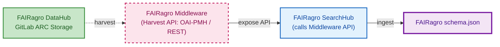
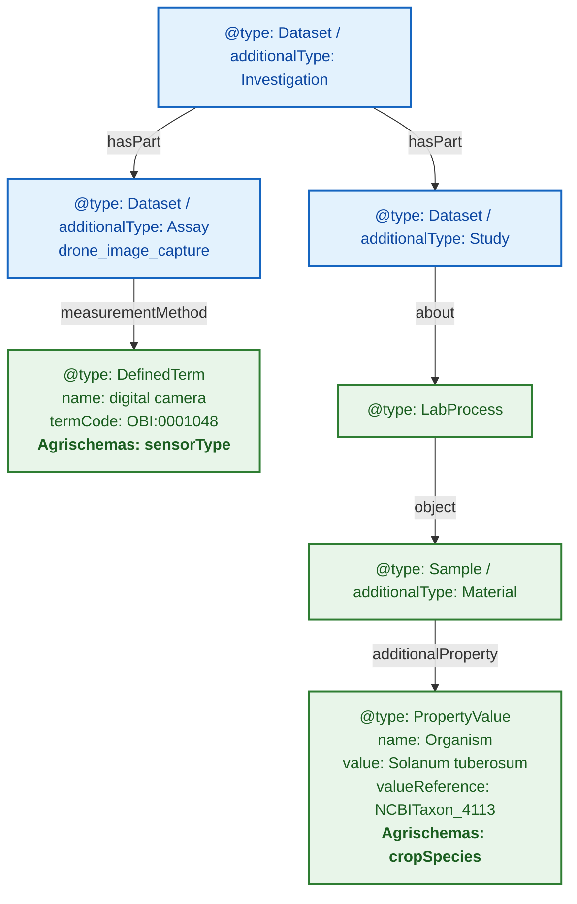
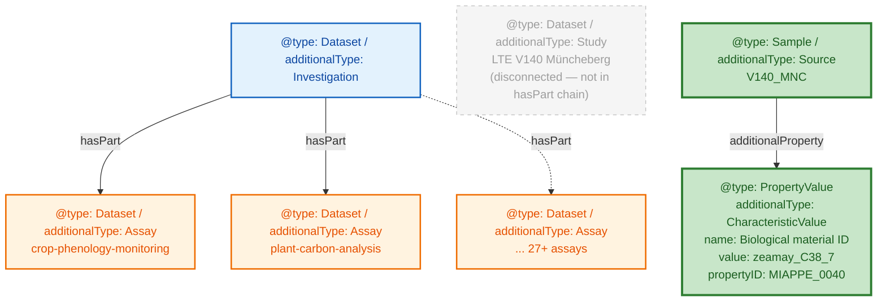
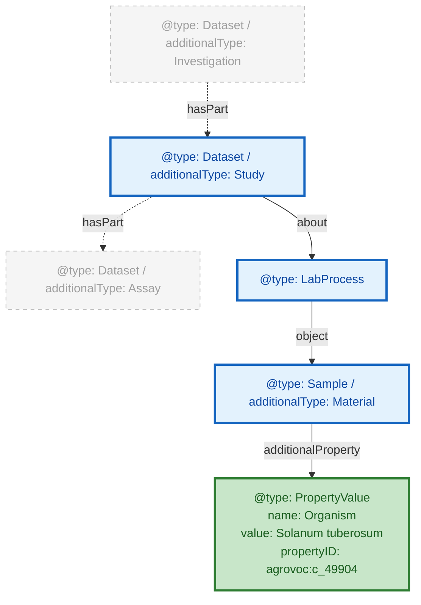

# FAIRweaver: Schema.org → ARC → FAIRagro Workflow

---

## Pipeline Overview — The Map

```mermaid
flowchart LR
    subgraph INPUT["Input"]
        I["Schema.org JSON-LD<br/>(RDI / Research Data Infrastructure)"]
    end

    subgraph TRANSFORM["Transformation"]
        T["FAIRagro Template/Spec<br/>Applied as Transformation Rules"]
    end

    subgraph OUTPUT_A["Output A — ARC RO-Crate"]
        A["arc-rocrate-metadata.json<br/>(Annotated Research Context)"]
    end

    subgraph DATAHUB["DataHub — GitLab ARC Storage"]
        DH["Full ARC<br/>(data + ARC RO-Crate)"]
    end

    subgraph HARVEST["Harvest Paths to SearchHub"]
        H1["Path 1: Direct<br/>(GitLab API)"]
        H2["Path 2: Middleware<br/>(OAI-PMH / REST API)"]
    end

    subgraph OUTPUT_B["Output B — FAIRagro SearchHub"]
        B["SearchHub ingests<br/>→ FAIRagro schema.json"]
    end

    I --> T
    T --> A
    A -->|place ARC| DH
    DH -->|direct| H1
    DH -.->|via Middleware API| H2
    H1 --> B
    H2 --> B

    classDef in fill:#e3f2fd,stroke:#1565c0,stroke-width:2px,color:#0d47a1
    classDef trans fill:#fff3e0,stroke:#ef6c00,stroke-width:2px,color:#e65100
    classDef outa fill:#e8f5e9,stroke:#2e7d32,stroke-width:2px,color:#1b5e20
    classDef datahub fill:#c8e6c9,stroke:#388e3c,stroke-width:2px,color:#1b5e20
    classDef harvest fill:#fce4ec,stroke:#c2185b,stroke-width:2px,color:#880e4f
    classDef outb fill:#f3e5f5,stroke:#7b1fa2,stroke-width:3px,color:#4a148c

    class I in
    class T trans
    class A outa
    class DH datahub
    class H1,H2 harvest
    class B outb
```



**Sequential dependency**: Schema.org → ARC RO-Crate → placed on **DataHub**. Both harvest paths read from the DataHub to feed the SearchHub.
Two paths converge on the same `schema.json`. Each following slide zooms into one stage.

**Reference**: Full FAIRagro infrastructure → `docs/slides/diagrams/FAIRagro_TA3_TA4_Retreat_2006_Slot2_impulse.png`

**Tracing dataset**: Wheat Drought Phenotyping Field Trial 2024 (ID: `10.5447/<RDI>/2024/wheat-drought-001`)

---

## Stage 1 · Input: FAIRagro Publication Metadata Set

Compliant with the FAIRagro Core Metadata Specification — **flat**, no ISA hierarchy, domain info as `about` entities.

```json
{
  "@context": {
    "@vocab": "https://schema.org/",
    "agrovoc": "http://aims.fao.org/aos/agrovoc/"
  },
  "@type": "Dataset",
  "@id": "https://doi.org/10.5447/<RDI>/2024/wheat-drought-001",
  "name": "Wheat Drought Phenotyping Field Trial 2024",
  "description": "Multi-temporal drone-based NDVI and multispectral imaging of winter wheat under controlled drought stress...",
  "url": "https://<RDI>.example.org/datasets/wheat-drought-2024",
  "license": "https://spdx.org/licenses/CC-BY-4.0.html",
  "keywords": [{
    "@type": "DefinedTerm",
    "name": "wheat",
    "termCode": "agrovoc:c_8347"
  }],
  "identifier": {
    "@type": "PropertyValue",
    "propertyID": "https://registry.identifiers.org/registry/doi",
    "value": "10.5447/<RDI>/2024/wheat-drought-001"
  },
  "author": [{
    "@type": "Person",
    "name": "Liam Brennecke",
    "affiliation": { "@type": "Organization", "name": "RPTU University of Kaiserslautern" }
  }],
  "spatialCoverage": {
    "@type": "Place",
    "name": "RPTU Field Station Kaiserslautern"
  }
}
```

> FAIRagro Publication Metadata Set (Section 2): 6 required fields — `name`, `description`, `url`, `keywords`, `license`, `identifier`. `author` replaces `creator`; `spatialCoverage` replaces `location`.
> Domain entities (Crop, Sensor) go into Agrischemas `about` — see next slide.

---

## Stage 1bis · Agrischemas: Same record, the `about` array

**Continuation of slide 1b** — same `Dataset`, same `@id` (`10.5447/<RDI>/2024/wheat-drought-001`). These Agrischemas domain entities go INSIDE the `Dataset` from the previous slide, under the `about` key.

```json
"about": [
  {
    "@type": "biosc:BioSample",
    "additionalType": "AGRO:AGRO_00000325",
    "additionalProperty": [{
      "@type": "PropertyValue",
      "name": "species",
      "propertyID": "agrovoc:c_331243",
      "value": "Triticum aestivum"
    }]
  },
  {
    "@type": "Product",
    "additionalType": "http://www.w3.org/ns/sosa/Sensor",
    "name": "Micasense RedEdge-MX"
  }
]
```

> **Crop** (Section 3.1): `BioSample` + `additionalType: AGRO_00000325` + species as `PropertyValue` with `propertyID: agrovoc:c_331243` (AGROVOC taxonomic species).
> **Sensor** (Section 3.4): `Product` + `additionalType: sosa:Sensor`.
> **Soil** (Section 3.2): `Sample` + `additionalType: agrovoc/c_7156` (omitted for slide brevity).
> Reference: `https://knowledgebase.fairagro.net/en/tech-guides/core_metadata_specification/`

---

## Stage 2 · Transformation: FAIRagro Template Applied

The template (YAML rule file) is the bridge. It declares how each Schema.org field lands in the ARC.

```yaml
source_format: schema_org
pivot: fairagro_searchhub
version: "1.0.0"
field_rules:
  - source: "name"               → target: "Investigation.name"
  - source: "description"        → target: "Investigation.description"
  - source: "author"             → target: "Investigation.creator"  [extract_person]
  - source: "identifier"         → target: "Investigation.identifier"
  - source: "spatialCoverage"    → target: "Investigation.location"  [extract_place]
  # Agrischemas about-entities:
  - source: "about/BioSample"    → target: "Study.crop"  [extract_agrischemas]
  - source: "about/Product"      → target: "Assay.instrument"  [extract_sensor]
```

Three kinds of rules:

1. **Direct copy** — `name`, `description`, `identifier` land verbatim
2. **Re-distribution** — Agrischemas `BioSample` → Study, `Product` → Assay
3. **Extract** — inline objects become separate graph entities with `@id` reference

Source: `backend/mappings/schema_org-arc_ro_crate.yaml`

---

## Stage 3 · Output A: ARC RO-Crate (ISA hierarchy)

One flat Schema.org `Dataset` becomes a **graph of linked entities** connected by `hasPart`.

```json
{
  "@context": ["https://w3id.org/ro/crate/1.1/context", { "@vocab": "https://schema.org/" }],
  "@graph": [
    {
      "@id": "./", "@type": "Dataset", "additionalType": "Investigation",
      "identifier": "10.5447/<RDI>/2024/wheat-drought-001",
      "name": "Wheat Drought Phenotyping Field Trial 2024",
      "creator": [{ "@id": "#Brennecke_Liam" }],
      "hasPart": [{ "@id": "#Study_wheat" }]
    },
    {
      "@id": "#Study_wheat", "@type": "Dataset", "additionalType": "Study",
      "crop_species": "Triticum aestivum",
      "crop_species_uri": "http://purl.obolibrary.org/obo/NCBITaxon_4565",
      "hasPart": [{ "@id": "#Assay_wheat" }]
    },
    {
      "@id": "#Assay_wheat", "@type": "Dataset", "additionalType": "Assay",
      "measurementTechnique": "Multispectral imaging",
      "technologyPlatform": "DJI Matrice 300 RTK UAV",
      "instrument": [{ "@id": "#Instrument_wheat" }]
    },
    { "@id": "#Brennecke_Liam", "@type": "Person", "name": "Liam Brennecke" },
    { "@id": "#Instrument_wheat", "@type": "Sensor", "name": "Micasense RedEdge-MX" }
  ]
}
```

> One flat `Dataset` → `@graph` of linked entities. `hasPart` chains I→S→A. Inline objects extracted.
> See slides 3–4 for how **real** ARCs deviate from this ideal structure.

---

## Stage 4a · Harvest Path 1: DataHub Direct


**Direct harvest** — the SearchHub reads directly from the DataHub via the GitLab API. No middleware in the loop. ARCs are accessed as GitLab repo files; the SearchHub ingests the ARC RO-Crate and produces `schema.json`.

---

## Stage 4b · Harvest Path 2: Middleware API



**Orchestrated harvest** via the federated Middleware. ARCs are stored on the DataHub; the Middleware harvests from the DataHub and exposes an API (OAI-PMH or REST) for the SearchHub to call. The Middleware never stores ARCs itself — the ARC full package always lives on the DataHub.

---

## Stage 5 · Output B: FAIRagro SearchHub JSON

The ARC graph is flattened — now **organized by domain block** instead of ISA hierarchy.

```json
{
  "@context": "https://fairagro.net/schema/v1",
  "@type": "Dataset",
  "citation": {
    "title": "Wheat Drought Phenotyping Field Trial 2024",
    "author": [{ "name": "Liam Brennecke", "orcid": "0000-0002-7391-4826" }],
    "otherId": [{ "value": "10.5447/<RDI>/2024/wheat-drought-001" }]
  },
  "crop": {
    "crop": [{ "scientificName": "Triticum aestivum",
               "ontologyRef": "NCBITaxon_4565" }]
  },
  "sensor": {
    "sensor": [{ "name": "Micasense RedEdge-MX",
                 "platformType": "DJI Matrice 300 RTK UAV" }]
  },
  "location": {
    "name": "RPTU Field Station Kaiserslautern",
    "geo": { "latitude": 49.4401, "longitude": 7.7491 }
  }
}
```

> Domain-block grouped: `citation`, `crop`, `sensor`, `location`. Full block set in `pivot_registry.yaml`.

---

## Pipeline Summary — Sequential Dependency & Two-Path Convergence

| Stage | Format | Key change |
|-------|--------|------------|
| **Input** | Schema.org `Dataset` | Flat, inline objects |
| **Transform** | YAML `field_rules` | Routing & extraction rules (template is the bridge) |
| **Output A** | ARC RO-Crate `@graph` | ISA hierarchy, `@id` refs, extracted entities |
| **Harvest** | Path 1 (solid) or Path 2 (dashed) | Direct from DataHub or orchestrated via Middleware |
| **Output B** | `fairagro schema.json` | Domain-block grouped, SearchHub-ready |

**Key insights:**

- **ARC is the single source of truth** — Output B is always derived from Output A.
- **Both harvest paths** produce identical `schema.json`. Pick by topology (direct = single RDI; middleware = federated).
- **What determines extraction depth?** → **Slide 2 • Compliance Spectrum**
- **How do real ARCs deviate?** → **Slides 3–5 • Structural Analysis**

---

## Three File Scenarios: Input → ARC → FAIRagro Output

| Case | Input File | ARC Output | FAIRagro Output |
|------|-----------|------------|-----------------|
| **Synthetic** | `schema-org-wheat-full.json` | `arc-ro-crate-wheat-full` ✅ compliant | Full extraction ✅ |
| **Real — Small** | `arc-ro-crate-dronflyover.json` (<10 MB) | Manual, partial ⚠️ | Partial — mappable fields only |
| **Real — Large** | `arc-ro-crate-muenchenberg-lte.json` (>100 MB) | Manual, partial ⚠️ | Basic harvest only |

**💡 If an ARC follows the FAIRagro specification → full metadata extraction. If not → only basic information is harvested.**

---

## Examining ARC Structure: Domain Objects at Different Depths

**Goal:**

- Understand how Agrischemas concepts map into ARC RO-Crate
- Show that equivalent domain concepts require very different traversal depths



**Example ARC RO-Crate:** UC13 drone-flyover

> **Note:** In the real data, Assay and Study are siblings under Investigation (via `hasPart`), not a nested chain. The Study does NOT contain the Assay via its own `hasPart` — that edge is empty. See the itemised data in `figure-code-snippets.md`.

---

## Müncheberg ARC: A Different Structural Pattern

**Goal:**

- Show another real ARC with a different structural pattern
- Reinforce that parser must handle multiple modeling conventions



| Aspect | Drone Flyover | Müncheberg LTE |
|--------|--------------|----------------|
| **Study entity** | Explicit, in hasPart chain | Present but disconnected (not in hasPart; `hasPart: []`) |
| **Crop species path (short)** | Study → LabProcess → Sample → PropertyValue (4 hops) | Source → additionalProperty → CharacteristicValue (2 hops) |
| **Crop species path (long)** | Same as short (only path) | ALSO via Study/LabProcess → object → Source → additionalProperty |
| **Sensor metadata** | Present (DefinedTerm) | Absent |
| **Assay count** | 1 | 27+ |

**Example ARC RO-Crate:** Müncheberg LTE

> **Note:** Müncheberg does have a Study entity (`studies/LTE-V140-Muencheberg/`) and LabProcess chains (via `Study.about`), just like the drone flyover. The key difference is that the Investigation's `hasPart` connects directly to the Assays, skipping the Study. The crop species path also has a shorter alternative at the Source level.

---

## Required Modeling Pattern & Standardization Gap

**Goal:**

- Define the required path for unambiguous extraction
- Identify what still needs standardization



**In bold:** required objects/properties to represent Crop

**Example ARC RO-Crate:** UC13 drone-flyover

**Open questions:**

| | |
|---|---|
| **Structure: ?** | How to formally specify the required traversal path? |
| **propertyID: SSSOM mapping** | How to standardize ontology term mappings? |
