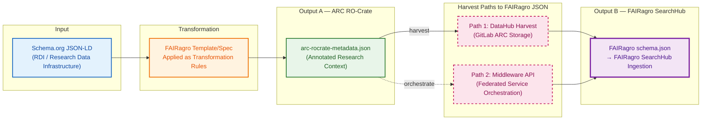
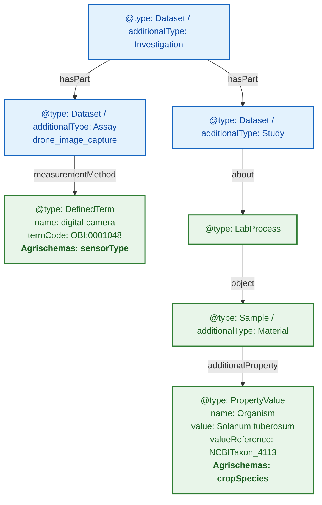
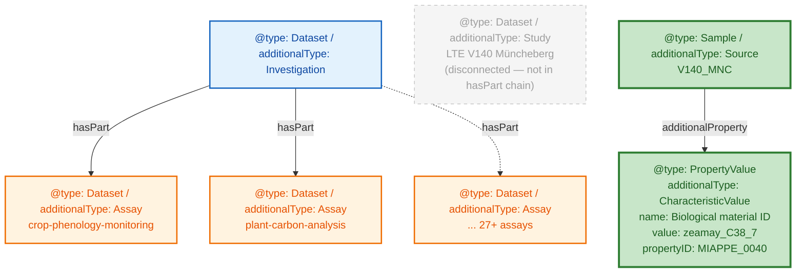
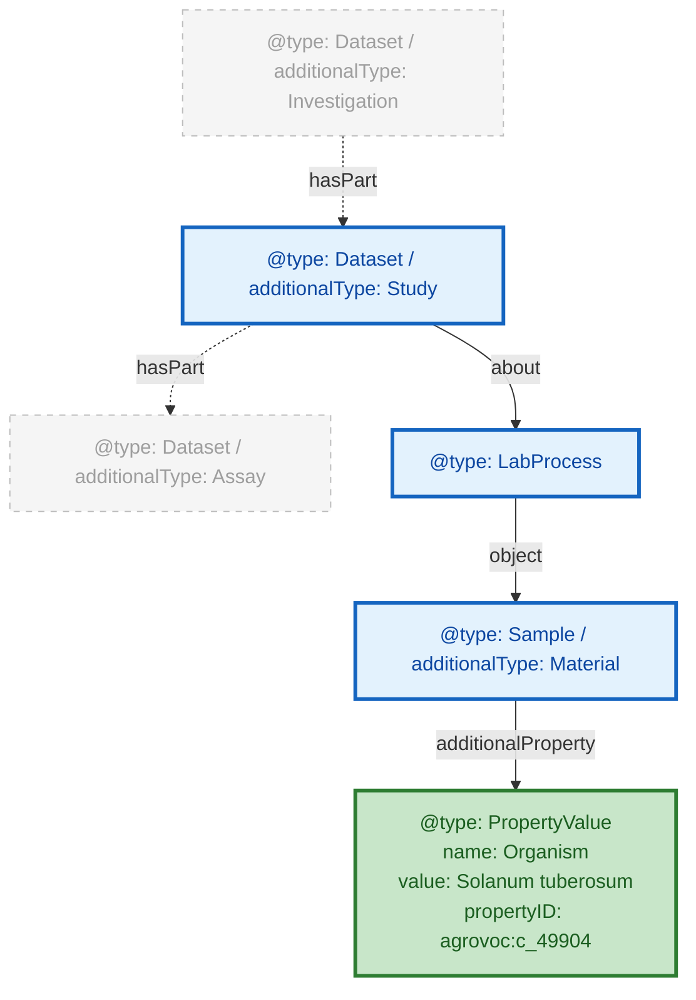

# FAIRweaver: Schema.org → ARC → FAIRagro Workflow

---

## FAIRagro Metadata Transformation Pipeline

**Key Points:**

- **Sequential dependency**: Output B (FAIRagro JSON) is derived *from* Output A (ARC RO-Crate) — not a parallel output
- **Two harvest paths** converge on the same FAIRagro JSON schema:
  - **Path 1 (solid)**: Direct harvest from GitLab DataHub where ARCs are stored
  - **Path 2 (dashed)**: Via FAIRagro Middleware API (federated service that orchestrates the full workflow)
- Both paths produce identical `FAIRagro schema.json` ingested into SearchHub

---

## Three File Scenarios: Input → ARC → FAIRagro Output

| Case | Input File | ARC Output | FAIRagro Output |
|------|-----------|------------|-----------------|
| **Synthetic** | `schema-org-wheat-full.json` | `arc-ro-crate-wheat-full` ✅ compliant | Full extraction ✅ |
| **Real — Small** | `arc-ro-crate-dronflyover.json` (<10 MB) | Manual, partial ⚠️ | Partial — mappable fields only |
| **Real — Large** | `arc-ro-crate-muenchenberg-lte.json` (>100 MB) | Manual, partial ⚠️ | Basic harvest only |

**💡 If an ARC follows the FAIRagro specification → full metadata extraction. If not → only basic information is harvested.**

---

## Examining ARC Structure: Domain Objects at Different Depths

**Goal:**

- Understand how Agrischemas concepts map into ARC RO-Crate
- Show that equivalent domain concepts require very different traversal depths

**Example ARC RO-Crate:** UC13 drone-flyover

> **Note:** In the real data, Assay and Study are siblings under Investigation (via `hasPart`), not a nested chain. The Study does NOT contain the Assay via its own `hasPart` — that edge is empty. See the itemised data in `figure-code-snippets.md`.

---

## Müncheberg ARC: A Different Structural Pattern

**Goal:**
- Show another real ARC with a different structural pattern
- Reinforce that parser must handle multiple modeling conventions

| Aspect | Drone Flyover | Müncheberg LTE |
|--------|--------------|----------------|
| **Study entity** | Explicit, in hasPart chain | Present but disconnected (not in hasPart; `hasPart: []`) |
| **Crop species path (short)** | Study → LabProcess → Sample → PropertyValue (4 hops) | Source → additionalProperty → CharacteristicValue (2 hops) |
| **Crop species path (long)** | Same as short (only path) | ALSO via Study/LabProcess → object → Source → additionalProperty |
| **Sensor metadata** | Present (DefinedTerm) | Absent |
| **Assay count** | 1 | 27+ |

**Example ARC RO-Crate:** Müncheberg LTE

> **Note:** Müncheberg does have a Study entity (`studies/LTE-V140-Muencheberg/`) and LabProcess chains (via `Study.about`), just like the drone flyover. The key difference is that the Investigation's `hasPart` connects directly to the Assays, skipping the Study. The crop species path also has a shorter alternative at the Source level.

---

## Required Modeling Pattern & Standardization Gap

**Goal:**

- Define the required path for unambiguous extraction
- Identify what still needs standardization

**In bold:** required objects/properties to represent Crop

**Example ARC RO-Crate:** UC13 drone-flyover

**Open questions:**

| | |
|---|---|
| **Structure: ?** | How to formally specify the required traversal path? |
| **propertyID: SSSOM mapping** | How to standardize ontology term mappings? |

---
