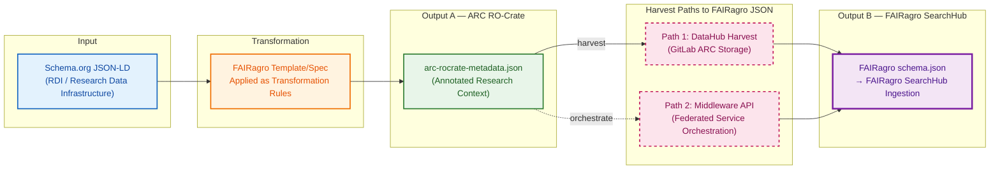
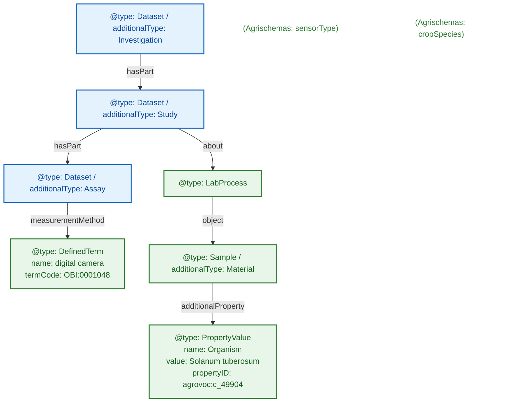
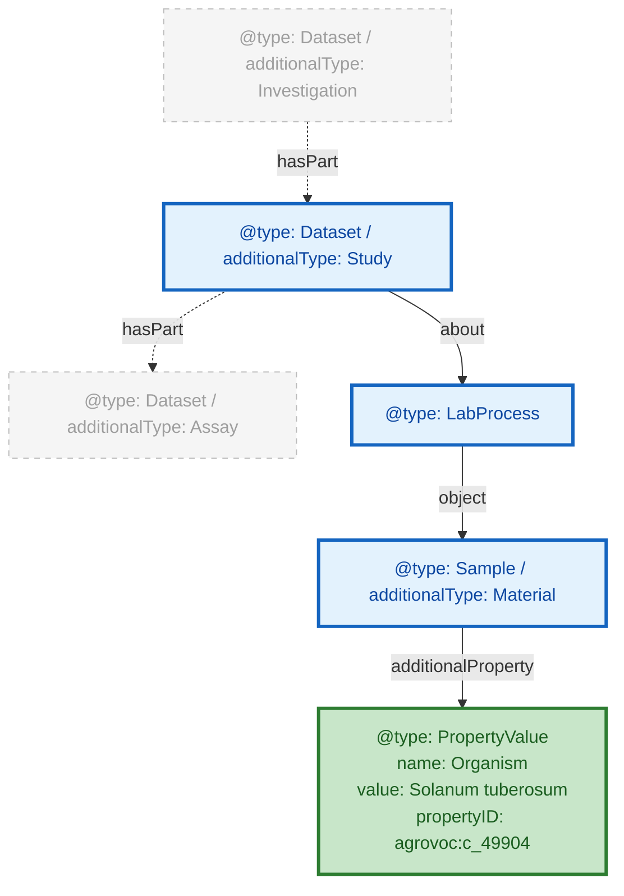

# FAIRweaver: Schema.org → ARC → FAIRagro Workflow

---

## Slide 1 — FAIRagro Metadata Transformation Pipeline

**Key Points:**

- **Sequential dependency**: Output B (FAIRagro JSON) is derived *from* Output A (ARC RO-Crate) — not a parallel output
- **Two harvest paths** converge on the same FAIRagro JSON schema:
  - **Path 1 (solid)**: Direct harvest from GitLab DataHub where ARCs are stored
  - **Path 2 (dashed)**: Via FAIRagro Middleware API (federated service that orchestrates the full workflow)
- Both paths produce identical `FAIRagro schema.json` ingested into SearchHub

---

## Slide 2 — Three File Scenarios: Input → ARC → FAIRagro Output

| Case | Input File | ARC Output | FAIRagro Output |
|------|-----------|------------|-----------------|
| **Synthetic** | `schema-org-wheat-full.json` | `arc-ro-crate-wheat-full` ✅ compliant | Full extraction ✅ |
| **Real — Small** | `arc-ro-crate-dronflyover.json` (<10 MB) | Manual, partial ⚠️ | Partial — mappable fields only |
| **Real — Large** | `arc-ro-crate-muenchenberg-lte.json` (>100 MB) | Manual, partial ⚠️ | Basic harvest only |

**💡 If an ARC follows the FAIRagro specification → full metadata extraction. If not → only basic information is harvested.**

---

## Slide 3 — Examining ARC Structure: Domain Objects at Different Depths

**Goal:**
- Understand how Agrischemas concepts map into ARC RO-Crate
- Show that equivalent domain concepts require very different traversal depths

**Example ARC RO-Crate:** UC13 drone-flyover

---

## Slide 4 — Required Modeling Pattern & Standardization Gap

**Goal:**
- Define the required path for unambiguous extraction
- Identify what still needs standardization

**In bold:** required objects/properties to represent Crop

**Example ARC RO-Crate:** UC13 drone-flyover

**Open questions:**

| | |
|---|---|
| **Structure: ?** | How to formally specify the required traversal path? |
| **propertyID: SSSOM mapping** | How to standardize ontology term mappings? |

---

